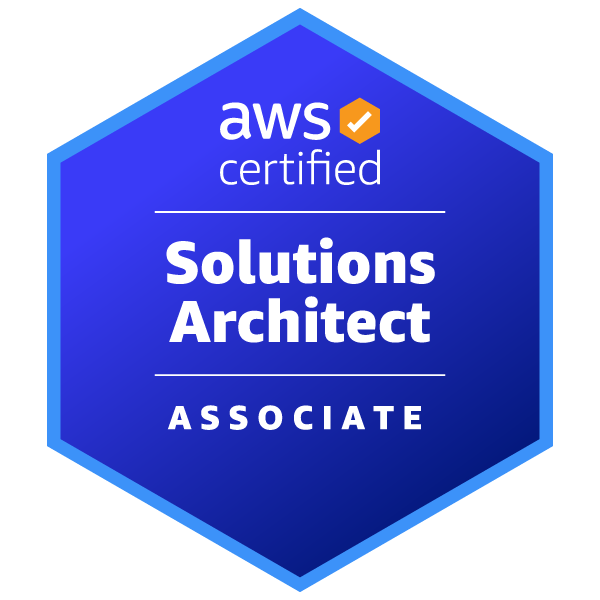
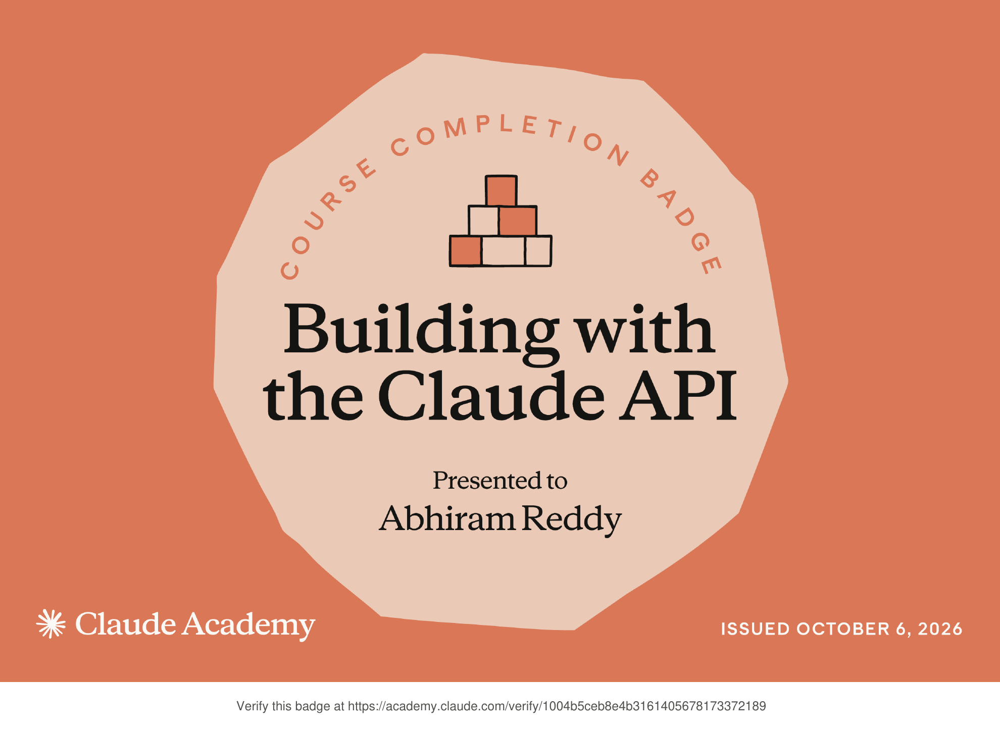

# Hi, I'm Abhiram Reddy Sripathi 👋

## AWS Cloud and Full-Stack Software Engineer

AWS Cloud and Full-Stack Software Engineer with 5+ years of experience designing, developing, integrating, deploying, and supporting enterprise applications across telecommunications, healthcare, and data-platform environments.

I build cloud-native and hybrid applications using AWS, React.js, TypeScript, Node.js, Python, .NET, REST APIs, microservices, event-driven integrations, and relational and NoSQL databases.

My experience includes secure authentication platforms, commercial scheduling and monitoring systems, marketing-content workflows, HIPAA-aligned healthcare applications, global developer portals, CI/CD automation, application security, observability, and production support.

---

## 🏆 Certifications

**AWS Certified Solutions Architect – Associate (SAA-C03)**  
Amazon Web Services | March 2026

 

**Building with the Claude API**  
Claude Academy | October 2026

Claude API development, prompt engineering, tool use, Model Context Protocol (MCP), prompt evaluation, prompt caching, and agentic workflows.

[Verify Credential](https://academy.claude.com/verify/1004b5ceb8e4b3161405678173372189) | [View Certificate](./claude-academy-badge-building-with-the-claude-api.pdf)

---

## ☁️ Technical Skills

**AWS & Cloud:**  
AWS Lambda, Amazon API Gateway, Amazon S3, Amazon CloudFront, Amazon EC2, Amazon EventBridge, Amazon Route 53, AWS Secrets Manager, Amazon VPC, Elastic Load Balancing, Auto Scaling, AWS CloudFormation, AWS CDK

**Programming Languages:**  
Python, JavaScript, TypeScript, C#, SQL, Bash/Shell Scripting

**Backend & Architecture:**  
Node.js, .NET, REST APIs, Microservices, Serverless Architecture, Event-Driven Architecture, Distributed Systems, Asynchronous Processing, File Processing, Enterprise Integrations

**Frontend Development:**  
React.js, Angular, HTML5, CSS3, Single-Page Applications, Responsive Web Design, Reusable Components, Design Systems, Internationalization, Localization

**Databases & Messaging:**  
Amazon RDS, Amazon DynamoDB, Oracle, MongoDB, Amazon SNS, Amazon SQS, Kafka, RabbitMQ

**DevOps & Delivery:**  
Git, GitHub, Bitbucket, Jenkins, CI/CD Pipelines, Infrastructure as Code, Automated Deployments, Release Management, Multi-Environment Deployment

**Monitoring & Testing:**  
Amazon CloudWatch, Splunk, Dynatrace, Postman, SoapUI, Unit Testing, Integration Testing, API Testing, Logging, Alerting, Root-Cause Analysis, Production Support

---

## 💼 Professional Experience

### Charter Communications  
**AWS Cloud Solutions Developer** | Feb 2026 – Present

Supporting Spectrum Reach through full-stack and cloud development using AWS, React.js, TypeScript, .NET, APIs, hybrid-cloud architecture, centralized authentication, infrastructure as code, commercial scheduling workflows, and marketing-content platforms.

### Tenet Health  
**AWS Cloud Application Developer** | Sep 2025 – Feb 2026

Supported cloud-native clinical, revenue-cycle, and patient-engagement applications used across more than 50 hospitals using AWS, .NET, C#, Python, Node.js, TypeScript, Angular, REST APIs, microservices, and event-driven integrations.

### Teradata  
**Software Engineer — Full Stack** | Jun 2020 – Nov 2024

Contributed to the Teradata Developer Portal using React.js, Node.js, MongoDB, Docusaurus, reusable components, shared design systems, internationalization, cross-browser development, and developer-focused technical documentation.

---

## 🚀 Featured Projects

### LaunchPad AI — AI-Assisted Cloud Deployment Architect

AI-assisted platform that analyzes GitHub repositories, identifies application architecture and technology choices, and generates cloud-readiness findings, security guidance, scaling recommendations, and deployment blueprints.

### [Serverless TaskFlow](https://github.com/sripathiabhiram29-droid/serverless-taskflow)

Serverless AWS task-management platform supporting task CRUD operations, status changes, historical activity tracking, REST APIs, Lambda backend services, DynamoDB data models, logging, and monitoring.

### [SpendWise](https://github.com/sripathiabhiram29-droid/spendwise-serverless-expense-tracker)

Full-stack serverless expense-management application supporting expense CRUD, categories, monthly filtering, totals, charts, and CSV export using S3, CloudFront, API Gateway, Lambda, and DynamoDB.

### [AWS Cloud Resume](https://github.com/sripathiabhiram29-droid/aws-cloud-resume)

Serverless cloud resume website hosted on Amazon S3 and delivered through CloudFront, with AWS-based backend functionality, infrastructure configuration, monitoring, and secure content delivery.

### [EventFlow AWS Order Processing](https://github.com/sripathiabhiram29-droid/eventflow-aws-order-processing)

Event-driven AWS order-processing project demonstrating asynchronous workflows, serverless services, decoupled application components, and cloud-native integration patterns.

---

## 📫 Contact

- **Email:** [sripathiabhiram29@gmail.com](mailto:sripathiabhiram29@gmail.com)
- **LinkedIn:** [linkedin.com/in/abhiram-reddy-s-357829254](https://www.linkedin.com/in/abhiram-reddy-s-357829254/)
- **GitHub:** [github.com/sripathiabhiram29-droid](https://github.com/sripathiabhiram29-droid)
